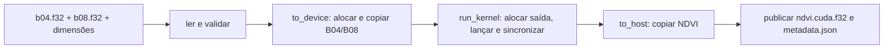

# Design da referência NDVI em CUDA C/C++

**Spec:** `.specs/features/ndvi-cuda-reference/spec.md`
**Status:** Draft para revisão

## Architecture Overview

O executável lê dois binários preparados e suas dimensões, constrói buffers host `float32`, copia cada banda para a GPU, executa um kernel CUDA, copia o resultado ao host e publica os dois artefatos de saída. O núcleo não conhece Sentinel-2, JSON de entrada ou Elixir. O programa trata uma matriz por execução.



As fronteiras de H2D, kernel e D2H correspondem às funções públicas `Ndvi.to_device/2`, `Ndvi.run_kernel/2` e `Ndvi.to_host/1`. Essa correspondência é operacional, não uma promessa de que os custos internos sejam iguais: `Ske.map2/3` também faz alocação/dispatch e o PolyHok pode compilar código em runtime. Um benchmark futuro terá de registrar esses componentes e informar se mediu tempo host da chamada ou tempo de atividade do dispositivo. Ele não poderá chamar a diferença entre um tempo CUDA event e um tempo host PolyHok de “overhead PolyHok”.

| Fronteira | Inclui nesta referência | Exclui |
| -------- | ------------------------ | ------ |
| Leitura | Abrir e ler B04/B08 para buffers host | Alocação e cópia GPU |
| H2D | Alocar dois buffers GPU e copiar as duas bandas | Kernel e leitura de arquivos |
| Kernel | Alocar buffer de saída GPU, lançar um kernel e aguardar sua conclusão | Cópia D2H e persistência |
| D2H | Alocar buffer host de resultado e copiar NDVI | Escrita em disco |
| Publicação | Gravar binário, calcular SHA-256 e promover metadata | Qualquer etapa GPU |

Uma medição host da função `run_kernel` incluirá alocação, dispatch e espera; um CUDA event em torno do lançamento observará apenas atividade no dispositivo. O protocolo experimental futuro deverá declarar qual medida é comparada em cada gráfico.

### Approaches considered

| Approach | Benefits | Cost | Decision |
| -------- | -------- | ---- | -------- |
| Executável CUDA independente com a mesma sequência de etapas | Isola a referência, aceita os mesmos bytes e é testável sem modificar Elixir | Startup e leitura precisam ser separados pelo benchmark futuro | Escolhida para a spec. |
| NIF CUDA chamado por Elixir | Partilha o processo e parte da coordenação | Acrescenta uma segunda integração Elixir e mistura seus custos com a referência direta | Não escolhida. |
| Programa CUDA que lê `.SAFE` diretamente | Uma única ferramenta de ponta a ponta | Mistura preparo geoespacial com o cálculo avaliado | Não escolhida. |

## Numerical and CUDA choices

- O kernel usa índice linear `size_t index = blockIdx.x * blockDim.x + threadIdx.x`, guarda `index < count` e escreve uma posição. O grid usa `ceil(count / 256)` blocos de 256 threads; antes do lançamento, valida `maxThreadsPerBlock` e `maxGridSize.x` do dispositivo.
- O caminho válido usa apenas `float`. A política é `isnan(b04) || isnan(b08) || (b08 + b04) == 0.0f ? NaN : (b08 - b04) / (b08 + b04)`. Na implementação, o denominador é calculado uma vez e usado nas duas verificações.
- O build não habilita `--use_fast_math`; fixa `--ftz=false` e `--prec-div=true` para preservar subnormais e divisão precisa. Essas opções são documentadas pelo [NVCC](https://docs.nvidia.com/cuda/cuda-compiler-driver-nvcc/).
- Uma chamada CUDA síncrona de cópia por banda e uma de retorno mantém a ordem e evita sobreposição. O kernel roda no stream padrão. O programa verifica o erro imediato do lançamento e sincroniza antes da D2H. A necessidade dessa sincronização decorre do [lançamento assíncrono de kernels](https://docs.nvidia.com/cuda/cuda-programming-guide/02-basics/asynchronous-execution.html).
- O fluxo usa buffers host comuns. A [documentação de sincronização da API CUDA](https://docs.nvidia.com/cuda/cuda-runtime-api/api-sync-behavior.html) distingue o comportamento de cópias de/para memória pageable; o benchmark futuro deverá informar esse regime de memória.

## Code Reuse Analysis

### Existing Components to Leverage

| Component | Location | How to Use |
| --------- | -------- | ---------- |
| Contrato numérico | `docs/ndvi-numerical-contract.md` | Fonte normativa da fórmula e casos especiais. |
| `PreparedReader` | `lib/polyhok_sentinel_2_parallel_analysis/sentinel_2/prepared_reader.ex` | Referência para layout, dimensões e validação de tamanho; não será chamado por C++. |
| `Ndvi` | `lib/polyhok_sentinel_2_parallel_analysis/sentinel_2/ndvi.ex` | Referência para a ordem das três fronteiras GPU. |
| `Ndvi.ResultWriter` | `lib/polyhok_sentinel_2_parallel_analysis/sentinel_2/ndvi/result_writer.ex` | Referência para layout do resultado, campos de metadata e publicação por último. |
| Testes GPU PolyHok | `test/sentinel_2/ndvi_test.exs` | Reutilizar os mesmos seis pares literais, signed zero, subnormal e resultado sem clamp. |
| Fixtures preparados | `fixtures/sentinel-2/manifest.json` e `prepared/*/metadata.json` | Fornecem identidade, caminhos e dimensões; o operador passa os caminhos e dimensões ao CLI. |

### Integration Points

| System | Integration Method |
| ------ | ------------------ |
| Dados preparados | CLI recebe os caminhos de `b04.f32` e `b08.f32` e a forma de um recorte existente. |
| CUDA Runtime | Alocação, cópias e kernel são encapsulados em três funções distintas. |
| Sistema de arquivos | O writer usa arquivos `.partial`, valida tamanho/SHA-256 e promove metadata por último. |
| Benchmark futuro | Instrumenta as três funções e trata leitura, startup e publicação separadamente. |

## Components

### Build CUDA

- **Purpose:** Compilar uma fonte `.cu` e o código host num executável local.
- **Location:** `cuda/CMakeLists.txt`.
- **Interface:** `cmake -S cuda -B cuda/build` e `cmake --build cuda/build` produzem `cuda/build/ndvi_cuda`.
- **Dependencies:** CMake 3.24 ou superior com suporte à linguagem CUDA, `nvcc`, C++17, CUDA Runtime e OpenSSL libcrypto para SHA-256.
- **Reuses:** Padrão local de gates por comando do README, sem alterar o build Mix.
- **Requirements:** Habilita CUDA-01 a CUDA-26.

Usar `project(... LANGUAGES CXX CUDA)`, o suporte de primeira classe recomendado pelo [CMake](https://cmake.org/cmake/help/latest/module/FindCUDA.html). Configurar uma arquitetura CUDA explícita no ambiente de build em vez de depender de flags legadas de `FindCUDA`.

### Núcleo CUDA

- **Purpose:** Manter as fronteiras H2D, kernel e D2H e a política numérica.
- **Location:** `cuda/src/ndvi.cu` com declarações em `cuda/include/ndvi_cuda.hpp`.
- **Interfaces:** `to_device(host_b04, host_b08, count)`, `run_kernel(device_inputs, count)`, `to_host(device_output, count)` e `compute(host_b04, host_b08, count)`.
- **Dependencies:** CUDA Runtime.
- **Reuses:** Sequência do `Ndvi.compute/2` e casos literais do contrato.
- **Requirements:** CUDA-01 a CUDA-09, CUDA-13, CUDA-14, CUDA-21 a CUDA-26.

Um objeto simples de resultado/erro ou exceções C++ com limpeza RAII mantém a propriedade dos buffers CUDA inequívoca. As três funções são chamadas independentemente pelo `compute`; elas não leem nem escrevem arquivos. `run_kernel` aloca a saída GPU, lança exatamente um kernel, confere `cudaGetLastError()` e sincroniza para capturar falhas assíncronas antes de retornar. A sincronização fica dentro da fronteira `run_kernel` para que sua conclusão signifique cálculo concluído.

### I/O binário e publicação

- **Purpose:** Ler matrizes preparadas e publicar uma saída no mesmo formato do writer PolyHok.
- **Location:** `cuda/src/io.cpp` com declarações em `cuda/include/ndvi_io.hpp`.
- **Interfaces:** `read_band(path, count) -> std::vector<float>` e `write_result(output_dir, host_ndvi, width, height) -> paths`.
- **Dependencies:** biblioteca padrão C++ e OpenSSL EVP para SHA-256.
- **Reuses:** Nomes de campos e ordem de publicação de `Ndvi.ResultWriter`.
- **Requirements:** CUDA-10, CUDA-12, CUDA-15 a CUDA-18.

A leitura verifica tamanho exato antes de interpretar o buffer. O programa deverá rejeitar host que não tenha `sizeof(float) == 4`, IEEE 754 binary32 e little-endian, pois os arquivos são little-endian. Isso evita interpretação silenciosa incorreta; suporte a host big-endian pode ser acrescentado depois. O SHA-256 é calculado sobre os bytes finais de `ndvi.cuda.f32`.

### CLI

- **Purpose:** Validar argumentos, compor leitura → GPU → publicação e reportar sucesso/erro.
- **Location:** `cuda/src/main.cpp`.
- **Interface:** `ndvi_cuda --b04 PATH --b08 PATH --width N --height N --output-dir DIR`.
- **Dependencies:** núcleo CUDA e I/O.
- **Reuses:** Convenção de saída JSON do preparador Python: uma linha de sucesso em stdout e diagnóstico em stderr.
- **Requirements:** CUDA-10 a CUDA-12, CUDA-14, CUDA-19 e CUDA-21.

O CLI valida dimensões e overflow antes de criar buffers. stdout é reservado para uma linha JSON de sucesso com `path` e `metadata_path` absolutos. Erros vão para stderr como uma linha JSON com `status`, `stage` (`arguments`, `read`, `h2d`, `kernel`, `d2h` ou `publish`) e `message`; retornam código diferente de zero. Não se introduzem flags de timing nesta feature.

## Data Models

### Entrada

```text
width: inteiro positivo
height: inteiro positivo
count: width * height, sem overflow de size_t
b04.f32, b08.f32: count * 4 bytes exatos cada
layout: IEEE 754 binary32, little-endian, row-major
```

### Saída

```json
{
  "width": 3,
  "height": 2,
  "dtype": "float32",
  "byte_order": "little-endian",
  "order": "row-major",
  "path": "ndvi.cuda.f32",
  "sha256": "<64 caracteres hexadecimais minúsculos>"
}
```

O diretório de saída é exclusivo da execução CUDA. Não usar o mesmo diretório de `ndvi.polyhok.f32`, pois ambos escrevem `metadata.json`.

### Publication sequence

```text
ndvi.cuda.f32.partial -> validar tamanho e SHA-256 -> remover metadata.json antigo
-> promover ndvi.cuda.f32 -> metadata.json.partial -> promover metadata.json
```

`metadata.json` é o ponto observável de conclusão. Se a operação falhar depois de remover o metadata antigo, pode restar binário órfão, que não constitui resultado publicado.

## Error Handling Strategy

| Error Scenario | Handling | Caller Impact |
| -------------- | -------- | ------------- |
| Argumento inválido ou overflow | Rejeitar antes de acessar a GPU. | Código não zero e etapa `arguments`. |
| Banda ausente, ilegível ou com tamanho errado | Rejeitar antes de acessar a GPU. | Código não zero e etapa `read`. |
| GPU ausente, bloco/grid inválido ou falha CUDA | Reportar código/descrição CUDA e limpar buffers. | Código não zero, etapa GPU identificada e nenhum metadata publicado. |
| Falha assíncrona no kernel | Verificar lançamento e sincronização. | Código não zero na etapa `kernel`. |
| Escrita, checksum ou rename falha | Não promover metadata final. | Código não zero e etapa `publish`; binário órfão é ignorado. |

## Testing Strategy

- Testes CLI sem GPU: flags obrigatórias, inteiros positivos, overflow, arquivo ausente, byte count divergente e nenhum metadata publicado.
- Testes CUDA sintéticos: seis pares do contrato; `-0.0f + -0.0f`; menor subnormal positivo; resultado `-3.0`; contagem não múltipla de 256. Validar resultado por valores e posições `NaN`, não por executar fórmula NDVI em CPU.
- Teste de publicação GPU: bytes `float32` little-endian, sete campos exatos, SHA-256, promoção metadata-last e falha induzida na promoção do binário.
- Teste de equivalência em cena real: gerar a saída PolyHok e a saída CUDA dos mesmos bytes, comparar forma, máscara `NaN` e diferença absoluta finita `<= 1.0e-6`. Esse teste exige a máquina CUDA e os binários preparados locais.
- O gate CUDA precisa rodar na máquina GPU antes de marcar a feature concluída. O macOS atual pode validar a estrutura da spec, mas não comprovar a execução do kernel.

## Risks & Concerns

| Concern | Location (file:line) | Impact | Mitigation |
| ------- | -------------------- | ------ | ---------- |
| `run_kernel/2` do PolyHok faz registro JIT e `Ske.map2/3` inclui alocação/dispatch. | `lib/polyhok_sentinel_2_parallel_analysis/sentinel_2/ndvi.ex:20` | Tempos host das duas implementações contêm parcelas diferentes; subtração ingênua não mede overhead puro. | Preservar fronteiras e exigir que o protocolo futuro descreva tempo host, tempo dispositivo, JIT e startup separadamente. |
| A dependência PolyHok usa um caminho absoluto local. | `mix.exs:24` | O teste de equivalência real não roda em checkout novo sem ambiente equivalente. | Executá-lo na máquina CUDA que possui PolyHok e registrar versões/caminhos de instalação no protocolo futuro. |
| Os `.f32` preparados não são versionados. | `fixtures/sentinel-2/README.md:28` | Teste real depende de dados locais externos ao Git. | Exigir recorte preparado válido e checksum do manifesto antes do gate real. |
| Testes CUDA existentes são opt-in. | `test/sentinel_2/ndvi_test.exs:73` | Gate CPU não prova equivalência do kernel. | Gate CUDA separado e obrigatório para fechar esta feature. |
| `--use_fast_math` pode mudar divisão e subnormais. | `docs/ndvi-numerical-contract.md:53` | Resultado pode divergir do contrato em denominadores pequenos. | Fixar flags de compilação precisas e testar o menor subnormal. |
| Saída no mesmo diretório que a versão PolyHok sobrescreveria `metadata.json`. | `lib/polyhok_sentinel_2_parallel_analysis/sentinel_2/ndvi/result_writer.ex:9` | Perda da descrição de uma das saídas. | Documentar diretórios distintos e testar o fluxo com destinos separados. |

## Tech Decisions

| Decision | Choice | Rationale |
| -------- | ------ | --------- |
| Forma da referência | Executável CUDA C++ direto | Faz o mesmo trabalho numérico sem adicionar outra ponte Elixir. |
| Build | CMake com linguagem CUDA de primeira classe | Mantém target e flags explícitos e evita o módulo `FindCUDA` descontinuado. |
| SHA-256 | OpenSSL EVP | Reutiliza biblioteca conhecida e evita implementação criptográfica própria. |
| Organização | Núcleo, I/O e CLI separados | Mantém etapas mensuráveis e testes de erro sem acoplar arquivos ao kernel. |
| Bloco | 256 threads, configuração fixa | Igual ao tamanho exercitado nos testes PolyHok atuais; tuning é uma etapa experimental posterior. |
| Medições | Sem temporização no protótipo; sincronização do kernel obrigatória | Entrega uma referência correta sem chamar tempos de naturezas diferentes pelo mesmo nome. |

Nenhuma escolha acima altera AD-001 ou AD-002 de `.specs/STATE.md`. Elas são locais a esta referência CUDA; não há novo ADR de projeto neste momento.
