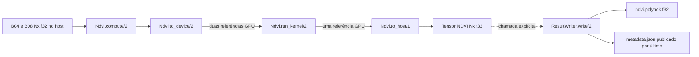

# Design do Protótipo Inicial de NDVI via PolyHok

**Spec:** `.specs/features/ndvi-polyhok-prototype/spec.md`
**Context:** `.specs/features/ndvi-polyhok-prototype/context.md`
**Status:** Approved

---

## Architecture Overview

O protótipo terá dois módulos. `Sentinel2.Ndvi` valida e compõe as três fronteiras
GPU usando `PolyHok.new_gnx/1`, `Ske.map2/3` e `PolyHok.get_gnx/1`.
`Sentinel2.Ndvi.ResultWriter` persiste o tensor já devolvido ao host. O cálculo não
conhece arquivos, metadata, cenas ou métricas.



`compute/2` será apenas validação seguida da composição `to_device/2` →
`run_kernel/2` → `to_host/1`. As três funções permanecem individualmente
acionáveis para que a instrumentação posterior possa envolver cada fronteira sem
alterar o núcleo.

---

## Chosen Approach

### Reutilizar `Ske.map2/3`

`Ske.map2/3` já aloca uma saída com a forma do primeiro tensor GPU, calcula um
índice linear, verifica `id < size` e executa uma função binária para cada posição.
O protótipo fornecerá somente a função NDVI por `PolyHok.phok/1`.

A expressão planejada é equivalente a:

```text
denominador = b08 + b04

if denominador != denominador or denominador == 0.0:
    denominador / denominador
else:
    (b08 - b04) / denominador
```

`denominador != denominador` detecta `NaN`. `denominador / denominador` preserva
`NaN` ou produz `NaN` para `+0.0f` e `-0.0f`. A fórmula normal permanece inalterada
para qualquer denominador não nulo.

Essa expressão é uma hipótese técnica até passar pelo teste GPU. O primeiro passo
de implementação deverá compilá-la e executá-la sobre os seis casos aprovados. Se
o compilador JIT do PolyHok não aceitar ou não preservar o resultado, a implementação
deverá parar e retornar ao design; não será permitido alterar o contrato numérico
nem introduzir uma aproximação silenciosa.

---

## Code Reuse Analysis

### Existing Components to Leverage

| Component | Location | How to Use |
| --------- | -------- | ---------- |
| `PreparedReader.read_crop/2` | `lib/polyhok_sentinel_2_parallel_analysis/sentinel_2/prepared_reader.ex` | Fornece os tensores host B04/B08 já tipados e formatados; não será chamado pelo núcleo. |
| `PreparedReader.normalize_little_endian/2` | `lib/polyhok_sentinel_2_parallel_analysis/sentinel_2/prepared_reader.ex` | Normaliza o binário nativo de `Nx.to_binary/1` antes da persistência em little-endian. |
| `PolyHok.new_gnx/1` | `/home/daniel/poly_hok/lib/poly_hok.ex` | Copia cada tensor Nx válido do host para a GPU preservando tipo e forma. |
| `Ske.map2/3` | `/home/daniel/poly_hok/lib/poly_hok/ske.ex` | Aloca a saída GPU e executa uma função binária em um único kernel com bounds check. |
| `PolyHok.get_gnx/1` | `/home/daniel/poly_hok/lib/poly_hok.ex` | Copia a saída GPU ao host como tensor Nx com tipo e forma preservados. |
| Jason e `:crypto` | `mix.exs` e OTP | Codificam metadata e calculam SHA-256 sem nova dependência. |
| Publicação manifest-last | `python/src/sentinel2_prepare/pipeline.py` | Inspira o metadata-last da saída, sem reutilizar o pipeline Python. |

### Integration Points

| System | Integration Method |
| ------ | ------------------ |
| Preparação Sentinel-2 | O chamador extrai `%{b04: b04, b08: b08}` de `PreparedReader` e passa os tensores a `Ndvi.compute/2`. |
| PolyHok/CUDA | `Ndvi` mantém referências GPU opacas e usa somente as três APIs existentes escolhidas. |
| Sistema de arquivos | `ResultWriter.write/2` recebe o tensor host e um diretório de destino explícito. |
| Benchmark futuro | Cronometradores envolverão `to_device/2`, `run_kernel/2` e `to_host/1`; não fazem parte desta feature. |

---

## Components

### `PolyhokSentinel2ParallelAnalysis.Sentinel2.Ndvi`

- **Purpose:** Validar as entradas, executar o NDVI via PolyHok e expor as três
  fronteiras GPU sem instrumentação.
- **Location:** `lib/polyhok_sentinel_2_parallel_analysis/sentinel_2/ndvi.ex`
- **Interfaces:**
  - `compute(b04, b08) :: Nx.Tensor.t()` — valida e compõe o fluxo completo.
  - `to_device(b04, b08) :: {term(), term()}` — realiza somente as duas cópias H2D.
  - `run_kernel(gpu_b04, gpu_b08) :: term()` — chama `Ske.map2/3` exatamente uma vez.
  - `to_host(gpu_ndvi) :: Nx.Tensor.t()` — realiza somente a cópia D2H.
- **Dependencies:** Nx, PolyHok e `Ske`.
- **Reuses:** `PolyHok.new_gnx/1`, `Ske.map2/3` e `PolyHok.get_gnx/1`.
- **Requirements:** NDVI-01 a NDVI-22.

A validação ficará privada dentro de `compute/2`. Ela verificará, nessa ordem:

1. ambos os valores são `%Nx.Tensor{}`;
2. ambos usam `{:f, 32}`;
3. ambos têm duas dimensões positivas;
4. ambos têm a mesma forma.

Nenhuma validação percorrerá pixels no host. Após a validação estrutural, erros do
PolyHok/CUDA serão propagados.

### `PolyhokSentinel2ParallelAnalysis.Sentinel2.Ndvi.ResultWriter`

- **Purpose:** Persistir um tensor NDVI host como binário reproduzível e metadata
  verificável.
- **Location:** `lib/polyhok_sentinel_2_parallel_analysis/sentinel_2/ndvi/result_writer.ex`
- **Interfaces:**
  - `write(ndvi, destination) :: {:ok, map()} | {:error, term()}` — grava, valida e
    publica `ndvi.polyhok.f32` e `metadata.json`.
- **Dependencies:** Nx, Jason, `:crypto` e sistema de arquivos.
- **Reuses:** `PreparedReader.normalize_little_endian/2` para a conversão simétrica
  entre endianidade nativa e little-endian.
- **Requirements:** NDVI-23 a NDVI-27.

O writer aceitará somente tensor bidimensional `{:f, 32}` e diretório de destino.
Ele não calculará NDVI e não chamará PolyHok.

---

## Data Models

### Referência GPU

As referências produzidas por PolyHok permanecerão opacas. O código não criará
struct, behavior ou wrapper próprio. `to_device/2` devolverá o par de termos e
`run_kernel/2` devolverá o termo de saída recebido de `Ske.map2/3`.

### `metadata.json`

```json
{
  "width": 3,
  "height": 2,
  "dtype": "float32",
  "byte_order": "little-endian",
  "order": "row-major",
  "path": "ndvi.polyhok.f32",
  "sha256": "<64 hexadecimal characters>"
}
```

O metadata descreve somente o artefato NDVI local. Ele não duplica o manifesto da
cena, não registra métricas e não altera os metadados dos recortes preparados.

### Publication Sequence

```text
Nx tensor host
    -> Nx.to_binary/1 em ordem row-major e endianidade nativa
    -> normalização para little-endian
    -> ndvi.polyhok.f32.partial
    -> validação de tamanho e SHA-256
    -> rename para ndvi.polyhok.f32
    -> metadata.json.partial
    -> rename para metadata.json (commit point)
```

Uma nova escrita substitui os dois artefatos no mesmo destino. Um binário órfão
sem metadata final válido não representa resultado publicado.

---

## Error Handling Strategy

| Error Scenario | Handling | Caller Impact |
| -------------- | -------- | ------------- |
| Entrada não é Nx | `compute/2` levanta `ArgumentError` antes da GPU. | Falha imediata com diagnóstico de entrada. |
| Tipo diferente de `{:f, 32}` | `compute/2` levanta `ArgumentError` antes da GPU. | Nenhuma alocação GPU. |
| Forma não bidimensional, vazia ou divergente | `compute/2` levanta `ArgumentError` antes da GPU. | Nenhuma alocação GPU. |
| PolyHok/NIF/CUDA falha | A exceção ou erro nativo é propagado. | Nenhum tensor parcial é devolvido como sucesso. |
| Tensor inválido para persistência | `write/2` retorna `{:error, :invalid_tensor}`. | Nenhum metadata novo é publicado. |
| Criação do diretório, escrita, validação ou rename falha | `write/2` retorna `{:error, reason}`. | `metadata.json` final não é substituído pela tentativa incompleta. |

---

## Testing Strategy

### Testes sem GPU

- Validar os quatro grupos de entrada inválida de `compute/2` sem implementar a
  fórmula NDVI em CPU.
- Persistir e reler um tensor Nx conhecido, incluindo `NaN`, para confirmar bytes,
  forma, ordem, metadata e checksum.
- Simular falha de escrita com destino controlado e confirmar que não surge um
  metadata final válido.

### Teste GPU explícito

- Manter `async: false` e `@tag :gpu`, seguindo `test/poly_hok_test.exs`.
- Enviar uma matriz `2x3` com os seis pares do contrato em uma única execução.
- Verificar tipo e forma do tensor devolvido.
- Verificar `0.5`, `0.0` e `-0.5` com `atol: 1.0e-6`, `rtol: 0.0`.
- Verificar individualmente as três posições `NaN`.
- Adicionar um tamanho não múltiplo de 256 somente se a matriz `2x3` já não
  comprovar o bounds check; ela possui seis elementos e já exercita essa condição.

O teste não calculará um tensor esperado por uma implementação CPU da fórmula. Os
resultados esperados serão literais definidos no contrato.

---

## Risks & Concerns

| Concern | Location (file:line) | Impact | Mitigation |
| ------- | -------------------- | ------ | ---------- |
| Geração de `NaN` pelo JIT ainda não foi demonstrada. | `/home/daniel/poly_hok/lib/poly_hok/cuda_backend.ex:696` | A expressão pode não compilar ou pode produzir valor diferente do contrato. | Fazer do caso sintético GPU o primeiro gate; parar e revisar o design se falhar. |
| `Ske.map2/3` agrupa alocação da saída e lançamento. | `/home/daniel/poly_hok/lib/poly_hok/ske.ex:151` | Cronometrar `run_kernel/2` no host incluirá custo de alocação/dispatch, não tempo CUDA puro. | Preservar a fronteira agora e usar CUDA events ou instrumentação NIF apenas na feature de benchmark. |
| O lançamento consulta apenas `cudaGetLastError`. | `/home/daniel/poly_hok/lib/poly_hok/cuda_backend.ex:838` | Uma falha assíncrona pode aparecer somente na cópia D2H. | Não reinterpretar o ponto da falha; propagar o erro nativo e tratar sincronização na instrumentação futura. |
| O teste GPU é excluído por padrão. | `test/test_helper.exs:2` | O gate comum não comprova o kernel. | Definir um gate GPU explícito e obrigatório para concluir as tarefas do núcleo. |
| `Nx.to_binary/1` usa endianidade do sistema. | `deps/nx/lib/nx.ex:1994` | O arquivo persistido divergiria em host big-endian. | Normalizar palavras de 32 bits antes da escrita e testar a função de conversão existente. |
| A dependência PolyHok usa caminho local absoluto. | `mix.exs:26` | O protótipo não compila em outra máquina sem o mesmo checkout. | Não alterar nesta feature; documentar como pré-condição do ambiente já validado. |
| Os três buffers `8192x8192` exigem ao menos 768 MiB, além de overhead. | `docs/ndvi-numerical-contract.md` | Um teste com recorte máximo pode falhar por memória e não pertence ao protótipo. | Usar somente casos sintéticos nesta feature e medir recortes reais na etapa experimental. |

---

## Tech Decisions

| Decision | Choice | Rationale |
| -------- | ------ | --------- |
| Primitiva de kernel | `Ske.map2/3` com função `PolyHok.phok/1` | Reutiliza índice, bounds check, alocação e kernel binário existentes com o mínimo de código. |
| Organização do código | Um módulo de cálculo e um writer subordinado | Separa I/O do cálculo sem criar camadas ou protocolos genéricos. |
| Representação GPU | Termos opacos do PolyHok | Um wrapper próprio não acrescentaria garantia útil ao protótipo. |
| Política de erro do cálculo | `ArgumentError` para contrato estrutural; falha GPU nativa propagada | Evita normalização especulativa e mantém diagnósticos originais. |
| Política de erro da persistência | Tupla `{:ok, metadata}` ou `{:error, reason}` | I/O possui falhas operacionais esperadas e se compõe sem exceções próprias. |
| Publicação | Binário validado primeiro, `metadata.json` por último | Fornece um ponto simples de conclusão e não mistura saída com artefatos preparados. |
| Instrumentação | Apenas fronteiras acionáveis; nenhum timer | Atende à evolução prevista na monografia sem antecipar o protocolo experimental. |

Nenhuma nova decisão atende aos três critérios para entrar em `.specs/STATE.md`.
As escolhas acima são locais a este protótipo e não alteram AD-001 ou AD-002.
