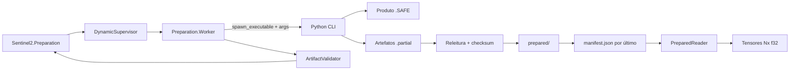

# Sentinel-2 Data Preparation Design

**Spec**: `.specs/features/sentinel-2-data-preparation/spec.md`
**Status**: Approved

---

## Architecture Overview

O produtor Python descobre e valida o produto `.SAFE`, lê janelas alinhadas com Rasterio, converte os pixels com NumPy e publica artefatos validados. O manifesto é o ponto de commit da cena. O Elixir executa o CLI em um `Port` pertencente a um worker supervisionado, valida o contrato publicado e expõe tensores Nx somente depois do sucesso.



### Abordagens consideradas

| Abordagem | Vantagens | Custos | Decisão |
| --------- | --------- | ------ | ------- |
| `Port` em `GenServer` supervisionado | Argumentos separados, mensagens de saída e exit status explícitos; timeout e registro por cena ficam no mesmo processo | Exige um pequeno loop de mensagens e fechamento explícito no timeout | Escolhida |
| `System.cmd/3` dentro de `Task.Supervisor` | Menos código para o caminho feliz | Timeout, diagnóstico incremental e ciclo de vida do processo externo ficam menos explícitos | Rejeitada |
| Biblioteca externa de gerenciamento de processos | Cancelamento de árvore de processos mais forte | Nova dependência e escopo maior do que a versão aprovada | Adiada |

## Code Reuse Analysis

### Existing Components to Leverage

| Component | Location | How to Use |
| --------- | -------- | ---------- |
| Nx | dependência transitiva declarada por `poly_hok` em `mix.exs` | Construir tensores `f32` e aplicar a forma `{height, width}` sem listas intermediárias |
| Logger | aplicação OTP já iniciada em `mix.exs` | Registrar cena, duração, resultado e diagnóstico no worker |
| Contrato normativo | `docs/sentinel-2-data-preparation.md` | Definir nomes, recortes, fórmula, layout binário e campos dos metadados |
| Ignorados de fixtures | `.gitignore` | Preservar `.SAFE`, rasters, `.f32`, previews e temporários fora do Git |

### Integration Points

| System | Integration Method |
| ------ | ------------------ |
| Produto Sentinel-2 L2A | Rasterio abre B04/B08 10 m; `xml.etree.ElementTree` lê `MTD_MSIL2A.xml` e `MTD_TL.xml` |
| Python para Elixir | `Port.open({:spawn_executable, path}, [:binary, :exit_status, args: ...])` |
| Dataset preparado | JSON versionado, binários `float32` little-endian e checksums SHA-256 sob `fixtures/sentinel-2/` |

## Components

### Python Project

- **Purpose**: Declarar Python `>=3.11`, o CLI e dependências reproduzíveis.
- **Location**: `python/pyproject.toml`, `python/src/sentinel2_prepare/`
- **Interfaces**:
  - `sentinel2-prepare --safe PATH --root PATH [--source-uri URI]`
- **Dependencies**: NumPy 2.x compatível com Python 3.11, Rasterio 1.4.x, Pillow 12.x; pytest e Ruff em `dev`.
- **Reuses**: Estrutura PEP 621 e biblioteca padrão para XML, JSON, hashing e publicação.

### SAFE Metadata

- **Purpose**: Resolver um único granule/tile e extrair identidade, grade, offsets e valores especiais.
- **Location**: `python/src/sentinel2_prepare/metadata.py`
- **Interfaces**:
  - `discover_product(safe_path: Path) -> ProductMetadata`
- **Dependencies**: `xml.etree.ElementTree`, convenções Sentinel-2 L2A.
- **Reuses**: Campos definidos em `docs/sentinel-2-data-preparation.md`.

### Raster Preparation

- **Purpose**: Validar o alinhamento, calcular janelas e converter pares B04/B08 para `float32` com máscara conjunta.
- **Location**: `python/src/sentinel2_prepare/raster.py`
- **Interfaces**:
  - `inspect_grid(product: ProductMetadata) -> Grid`
  - `prepare_window(product: ProductMetadata, size: int) -> PreparedBands`
- **Dependencies**: Rasterio `Window`, NumPy.
- **Reuses**: Fórmula de centralização e conversão do contrato normativo.

### Artifact Publisher

- **Purpose**: Escrever, visualizar, reler, validar e promover os arquivos de um recorte.
- **Location**: `python/src/sentinel2_prepare/artifacts.py`
- **Interfaces**:
  - `write_crop(root: Path, scene: SceneIdentity, bands: PreparedBands) -> CropMetadata`
  - `validate_crop(root: Path, metadata_path: Path) -> CropMetadata`
- **Dependencies**: NumPy, Pillow, `hashlib`, `os.replace`.
- **Reuses**: Layout de `fixtures/sentinel-2/`.

### Preparation Pipeline

- **Purpose**: Implementar a transação da cena, reutilização íntegra e manifesto por último.
- **Location**: `python/src/sentinel2_prepare/pipeline.py`
- **Interfaces**:
  - `prepare_scene(safe_path: Path, root: Path, source_uri: str | None) -> PreparedScene`
- **Dependencies**: componentes Python anteriores.
- **Reuses**: `manifest.json` como commit point segundo AD-002.

### Elixir Supervision

- **Purpose**: Supervisionar workers e garantir um nome único por `scene-id`.
- **Location**: `lib/polyhok_sentinel_2_parallel_analysis/application.ex`
- **Interfaces**: árvore com `Registry` única e `DynamicSupervisor`.
- **Dependencies**: OTP.
- **Reuses**: aplicação Mix existente.

### Artifact Validator

- **Purpose**: Validar manifesto, metadados, caminhos, tamanhos e checksums antes do sucesso.
- **Location**: `lib/polyhok_sentinel_2_parallel_analysis/sentinel_2/artifact_validator.ex`
- **Interfaces**:
  - `validate(project_root, scene_id) :: {:ok, prepared_scene} | {:error, reason}`
- **Dependencies**: Jason, `:crypto`.
- **Reuses**: AD-002 e contrato JSON do produtor.

### Prepared Reader

- **Purpose**: Ler os dois binários e devolver tensores Nx com forma idêntica.
- **Location**: `lib/polyhok_sentinel_2_parallel_analysis/sentinel_2/prepared_reader.ex`
- **Interfaces**:
  - `read_crop(project_root, crop_metadata) :: {:ok, %{b04: Nx.Tensor.t(), b08: Nx.Tensor.t()}} | {:error, reason}`
- **Dependencies**: Nx.
- **Reuses**: metadados já validados pelo consumidor.

### Preparation Worker and API

- **Purpose**: Executar o Python, aplicar timeout, registrar o resultado e serializar a mesma cena.
- **Location**: `lib/polyhok_sentinel_2_parallel_analysis/sentinel_2/preparation_worker.ex`, `lib/polyhok_sentinel_2_parallel_analysis/sentinel_2/preparation.ex`
- **Interfaces**:
  - `Preparation.prepare(scene, opts) :: {:ok, prepared_scene} | {:error, reason}`
- **Dependencies**: `Port`, Registry, DynamicSupervisor, ArtifactValidator.
- **Reuses**: Logger e árvore OTP.

## Data Models

### ProductMetadata

| Field | Type | Meaning |
| ----- | ---- | ------- |
| `product_id`, `tile_id`, `sensing_time_utc` | `str` | Identidade estável da origem |
| `b04_path`, `b08_path`, `product_metadata_path`, `tile_metadata_path` | `Path` | Quatro entradas obrigatórias |
| `boa_offset_b04`, `boa_offset_b08`, `quantification` | `float` | Conversão radiométrica |
| `nodata`, `saturated` | `int` | Máscara conjunta |
| `source_checksum` | `str` | SHA-256 determinístico dos quatro arquivos e caminhos relativos |

### CropMetadata

Contém exatamente os campos mínimos da seção 7.2, mais `path_b04`, `path_b08`, `metadata_path` e `preview_path`, todos relativos à raiz do projeto. `pixel_size` e `origin` são pares numéricos. Checksums usam SHA-256 hexadecimal.

### Manifest v1

```json
{
  "schema_version": 1,
  "scenes": {
    "scene-id": {
      "status": "prepared",
      "product_id": "...",
      "source_checksum": "...",
      "crops": ["relative/metadata.json"]
    }
  }
}
```

### PreparedScene

Mapa Elixir com `scene_id`, `product_id`, `source_checksum` e três entradas em `crops`. Cada entrada expõe classe, dimensões, caminhos relativos, checksums e metadados espaciais/radiométricos.

## Error Handling Strategy

| Error Scenario | Handling | User Impact |
| -------------- | -------- | ----------- |
| Entrada ausente, ambígua ou metadado inválido | Exceção de domínio no Python; CLI imprime diagnóstico em stderr e sai diferente de zero | `{:error, {:process_failed, status, diagnostic}}` |
| Grades divergentes ou recorte maior que o tile | Falha antes de qualquer publicação no manifesto | Cena continua não preparada |
| Falha de escrita ou releitura | Temporários permanecem ignorados; manifesto não muda | Erro explícito e próxima execução refaz |
| Executável ou entrypoint ausente | Validação anterior ao `Port.open/2` | `{:error, :executable_not_found}` |
| Timeout | Worker fecha o Port, ignora mensagens tardias e retorna timeout | `{:error, :timeout}` |
| Exit status zero com artefato inválido | ArtifactValidator rejeita a cena | `{:error, reason}` |
| Segunda chamada da mesma cena | Registro único impede segundo worker | `{:error, :already_running}` |
| Binário com tamanho incorreto | Reader rejeita antes de criar tensor | `{:error, :invalid_byte_size}` |

## Risks & Concerns

| Concern | Location (file:line) | Impact | Mitigation |
| ------- | -------------------- | ------ | ---------- |
| O teste CUDA atual falha em hosts sem GPU | `test/poly_hok_test.exs:4` | O gate completo não é reproduzível em CPU | Marcar como `:gpu` e excluir essa tag por padrão, preservando execução explícita |
| O projeto ainda não tem árvore de supervisão | `mix.exs:14` | Não há owner estável para Registry e workers | Adicionar módulo Application e `mod:` no manifesto Mix |
| O projeto não possui decodificador JSON direto | `mix.exs:20` | Elixir não consegue validar manifesto e metadados | Adicionar Jason como única dependência nova no Elixir |
| Rasterio, Pillow e pytest não estão instalados | ambiente local verificado em 2026-08-20 | O produtor e seus gates não executam até preparar um venv | Criar `python/.venv`, instalar o extra `dev` e manter o ambiente ignorado |
| Nx interpreta binários na endianidade do sistema | contrato Nx atual | O contrato little-endian falharia em host big-endian | Detectar endianidade; trocar bytes por palavra de 32 bits antes de `Nx.from_binary/2` quando necessário |
| Fechar um Port não garante matar toda árvore de subprocessos em todos os SOs | limite documentado de Port | Um neto do processo pode sobreviver ao timeout | Classificar a chamada como timeout, exigir validação para reutilização e manter cancelamento forte adiado |
| O maior recorte exige centenas de MiB de RAM | `docs/sentinel-2-data-preparation.md:139` | Pico de memória pode limitar máquinas pequenas | Ler uma janela por vez, liberar referências entre classes e não manter os três tamanhos simultaneamente |

## Tech Decisions

| Decision | Choice | Rationale |
| -------- | ------ | --------- |
| Leitura raster | Rasterio 1.4.x | Suporta leitura por janela e mantém compatibilidade com Python 3.11 |
| Representação numérica Python | NumPy `<2.4` | Mantém Python 3.11 e escrita explícita `<f4` |
| JSON no Elixir | Jason 1.4.x | API pequena e consolidada; OTP 27 usado no projeto não expõe `:json` |
| Serialização por cena | Registry `:unique` + DynamicSupervisor | Evita átomos dinâmicos e retorna `:already_running` no segundo start |
| Integridade | SHA-256 | Disponível nas duas bibliotecas padrão e suficiente para detectar corrupção/reuso divergente |
| Leitura Elixir | Nx BinaryBackend com correção de endianidade | Evita listas de dezenas de milhões de floats e entrega a forma pedida |
